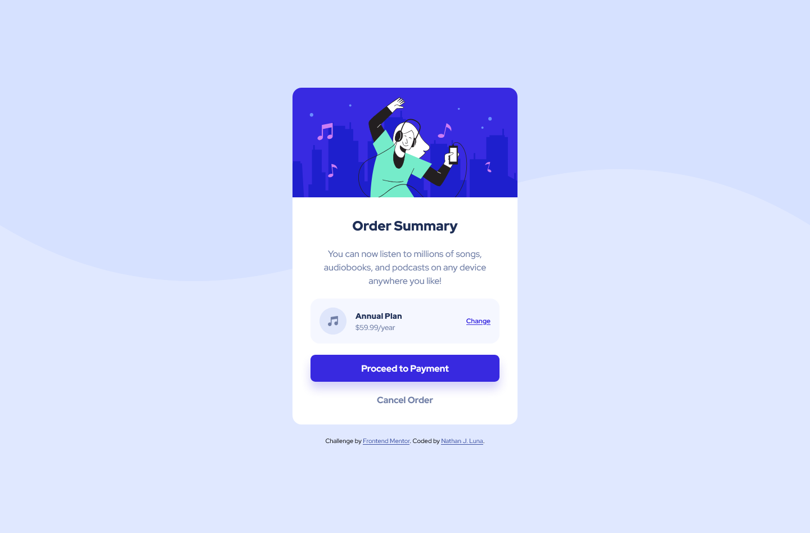

# order-summary-component

It has been almost a month since I have worked on a Frontend Mentor challenge, and I believe
I still have a lot to learn when using Javascript. Therefore, I'm going to be completing a few
more challenge that are exclusively HTML and CSS only.

This challenge was very simple, which made me implement a simple flex/grid layout as needed.
The hardest part about this challenge was the payment plan section, where the music note icon, prices
and change link were located.

# Frontend Mentor - Order summary card solution

This is a solution to the [Order summary card challenge on Frontend Mentor](https://www.frontendmentor.io/challenges/order-summary-component-QlPmajDUj). Frontend Mentor challenges help you improve your coding skills by building realistic projects. 

### Screenshot

### Links

- Solution URL: [My Solution](https://www.frontendmentor.io/solutions/order-summary-component-with-htmlcss--ST7j-nMHK)
- Live Site URL: [My Live Site](https://njmoon21.github.io/order-summary-component/)

